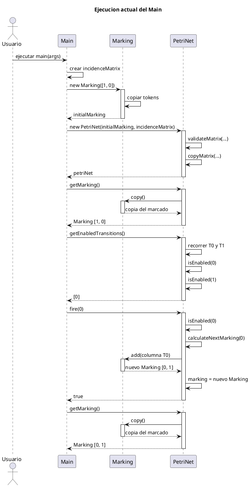
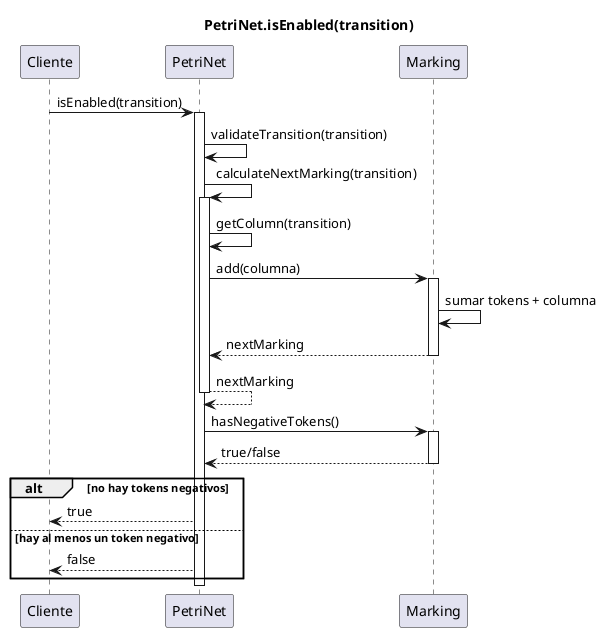
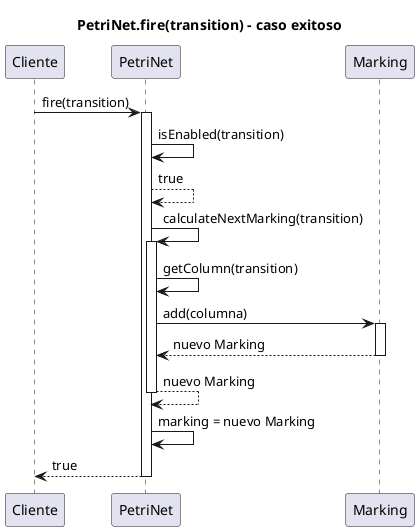
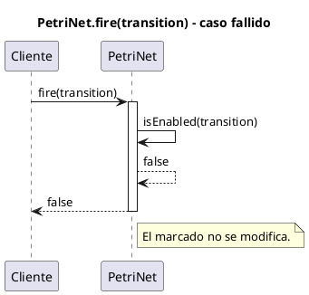
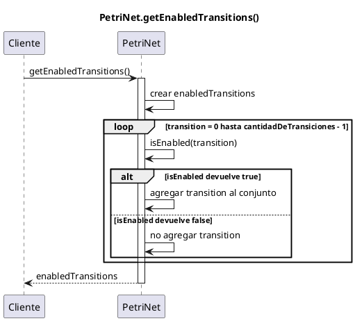

# Diagramas de secuencia - Estado actual del código

Estos diagramas describen solamente lo que está implementado por ahora en:

```text
app/Main.java
petri/PetriNet.java
petri/Marking.java
```

Todavía no incluyen monitor, hilos, políticas, colas ni tiempos.

## 1. Ejecución actual del Main

Este diagrama muestra el ejemplo mínimo que hay en `Main`: se crea una red con dos plazas y dos transiciones, se consulta el marcado, se consultan las transiciones sensibilizadas y se dispara `T0`.



## 2. Consulta de sensibilización: `isEnabled(transition)`

Este diagrama muestra cómo `PetriNet` decide si una transición está sensibilizada. La idea es calcular un marcado tentativo y verificar que no queden tokens negativos.



## 3. Disparo exitoso: `fire(transition)`

Este diagrama muestra el caso en el que una transición puede dispararse. Primero se valida con `isEnabled`. Si da `true`, se calcula el nuevo marcado y se guarda en la red.



## 4. Disparo fallido: `fire(transition)`

Este diagrama muestra el caso en el que una transición no puede dispararse. `isEnabled` devuelve `false`, entonces `fire` no modifica el marcado.



## 5. Consulta de todas las transiciones sensibilizadas

Este diagrama muestra cómo `getEnabledTransitions()` recorre todas las transiciones y usa `isEnabled` para construir el conjunto resultado.



## Resumen para pasar junto con el código

```text
El código actual implementa una Red de Petri secuencial mínima.

Marking representa el marcado actual mediante un arreglo de tokens.
PetriNet guarda el marcado y la matriz de incidencia.

Para saber si una transición está sensibilizada, PetriNet calcula un marcado tentativo:

    marcadoTentativo = marcadoActual + columnaDeLaTransicion

Si ese marcado tentativo tiene algún valor negativo, la transición no está sensibilizada.
Si no tiene valores negativos, la transición está sensibilizada.

fire(transition) primero llama a isEnabled(transition).
Si isEnabled devuelve false, no modifica el marcado y devuelve false.
Si isEnabled devuelve true, calcula el nuevo marcado, lo guarda y devuelve true.

getEnabledTransitions() recorre todas las transiciones y devuelve las que están sensibilizadas.

Todavía no está implementado el monitor, la concurrencia, las colas, la política ni la semántica temporal.
```
